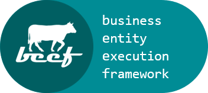
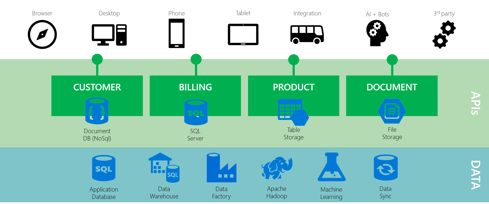
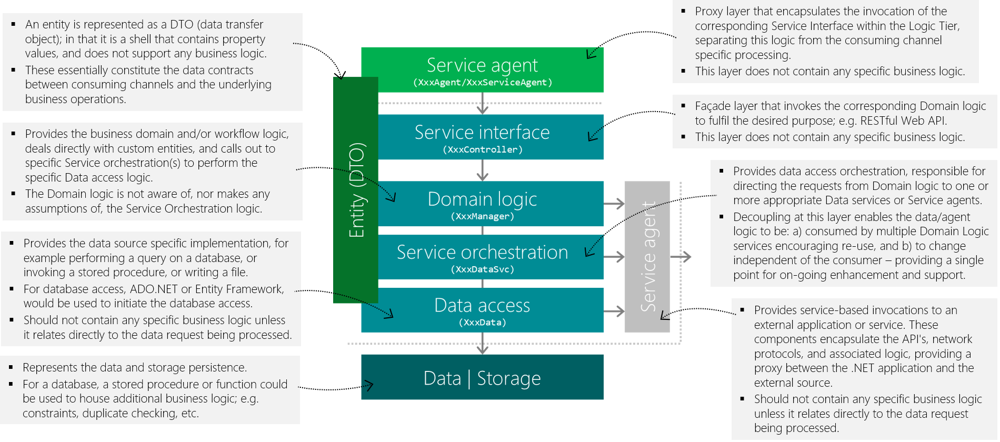
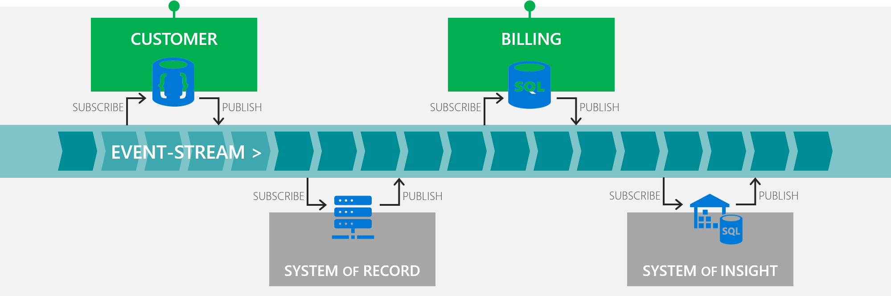

 

 

## Introduction

The _Beef_ framework, and the underlying code generation, has been primarily created to support the **industralisation** of API development.

> A means to have software developers focus directly on the **accelerated** delivery of **business value**; with consistently **higher quality** outcomes at an overall **lower cost**.

The key industralisation goals are:
1. **Value** – focus on business value, not on boilerplate
2. **Acceleration** – improve velocity; reduce costs and time to market
3. **Simplicity** – increase effective usage and minimise learning
4. **Standardised** – increase knowledgeable resource pool
5. **Consistency** – improve overall quality and maintainability
6. **Flexibility** – enable innovation and evolution easily over time
7. **Confidence** – reduced delivery timeframes and risk 

 

## Rapid enterprise-grade API development

As a result of the _Beef_ [Architecture](#Architecture), supporting [Framework](#Framework) and included [Code Generation](#Code-generation) capabilities, enterprise-grade APIs can be developed in a matter of hours, not days, in a standardised and consistent manner.

The APIs created will have the following capabilities out-of-the-box with limited developer effort, so the developer can focus on the key business value:
- Rich [Entity](./docs/Layer-Entity.md) (DTO) functionality including [`INotifyPropertyChanged`](https://docs.microsoft.com/en-us/dotnet/api/system.componentmodel.inotifypropertychanged), [`IEditableObject`](https://docs.microsoft.com/en-us/dotnet/api/system.componentmodel.ieditableobject), [`IEquatable`](https://docs.microsoft.com/en-us/dotnet/api/system.iequatable-1), [`ICloneable`](./src/Beef.Abstractions/Entities/ICloneable.cs), [`ICopyFrom`](./src/Beef.Abstractions/Entities/ICopyFrom.cs), [`ICleanUp`](./src/Beef.Abstractions/Entities/ICleanUp.cs), [`IUniqueKey`](./src/Beef.Abstractions/Entities/IUniqueKey.cs), etc.
- Rich [Reference data](./docs/Reference-Data.md) capabilities, including caching, optimised serialisation, and enriched API endpoints.
- Rich [Validation](./docs/Beef-Validation.md) capability to simplify and ensure data integrity and consistency.
- CRUD (Create, Read, Update and Delete) for Database ([Stored procedures](./src/Beef.Data.Database/README.md) and [Entity Framework](./src/Beef.Data.EntityFrameworkCore/README.md)), [Cosmos DB](./src/Beef.Data.Cosmos/README.md) and [OData](./src/Beef.Data.OData/README.md) in a standardised manner. 
- An approach and tooling to automate and manage [database](./tools/Beef.Database.Core/README.md) set up, configuration, and deployment.
- [Paging](./src/Beef.Abstractions/Entities/PagingArgs.cs) (skip and top) and resulting total count, that flows from API through to the underlying data source in a consistent and seamless manner.
- [ETag](https://en.wikipedia.org/wiki/HTTP_ETag) (concurrency) and `If-Match`/`If-None-Match` handling.
- JSON response field [filtering (include/exclude)](./src/Beef.Core/Json/JsonPropertyFilter.cs) to minimise resulting payload size (e.g. `$fields=firstname,lastname`)
- [HTTP Patch](./docs/Http-Patch.md) support, where required, in a simplified and consistent manner.
- An end-to-end intra-domain [integration testing](./tools/Beef.Test.NUnit/README.md) approach enables effective tests to be built easily and quickly.
- [gRPC](./src/Beef.Grpc/README.md) server (and client) integration.
- [Event](./src/Beef.Events/README.md) publishing and subcribing to enable an event-driven architecture.

To implement these included capabilities would literally take  months/years to build and test; these are available for developers to use immediately, and contribute back if so inclined. The capabilities and implementations have been influenced by _Microsoft's best practices for cloud applications_; specifically:
- [RESTful web API design](https://docs.microsoft.com/en-us/azure/architecture/best-practices/api-design)
- [Web API implementation](https://docs.microsoft.com/en-us/azure/architecture/best-practices/api-implementation)

To [get started](#Getting-started) a .NET Core [template capability](./templates/Beef.Template.Solution/README.md) is provided to enable you to get a solution up and running in minutes.

 

## Architecture

_Beef_ has been developed to encourage the standardisation and industrialisation of the tiering and layering within the microservices (APIs) of an Application Architecture.

 

### API-enabled domain-based channel-agnostic architecture 

The conceptual architecture is as follows; with _Beef_ being targeted specifically at implementation of the API tier.

The key concepts are as follows:

- **Channel-agnostic** - the APIs are based around the key entities and the operations that can be performed on them: 
  - APIs represent the key trust boundary; as such, they make no assumptions on the consumer. The APIs will always validate the request data, and house the application’s functional business and orchestration rules.
  - APIs should not be developed to service a specific user interface interaction; as the APIs are agnostic to the consumer. The consumer has the responsibility of coordinating across API calls.
- **Domain-based** – the APIs are based around, and encapsulate, the capabilities for a functional domain:
  - Outcome of a [Domain-Driven Design](https://en.wikipedia.org/wiki/Domain-driven_design); divides capapabilities into different [Bounded Contexts](https://www.martinfowler.com/bliki/BoundedContext.html).
  - Encourages micro vs monolithic services.

 

### Microservices

An architectural pattern for creating domain-based APIs:

- Is a software architecture style in which complex applications are composed of small, independent processes communicating with each other using language-agnostic APIs.
- These services are small, highly decoupled and focus on doing a small task, facilitating a modular approach to system-building.
- Implementation independence:
  - **Loose coupling** – should have its own persistence repository; data is duplicated (synchronised), not shared; eventual consistency; no distributed transactions.
  - **Polyglot persistence / programming** – use the best persistence repository to support the storage requirements; use a mix of programming languages (fit-for-purpose). Note: _Beef_ provides a C# / .NET implementation approach as one option.
  - **Eventual consistency** - for the most part, eventual consistency is good enough; real-time distributed transactional integrity is rarely required (although generally desired). An asynchronous messaging system, such as Queues or a Service Bus, can be leveraged to orchestrate cross domain data (eventual) consistency.

> “Micro” doesn’t imply number of lines of code; but a bounded concept / business capability within your Domain. - [http://herdingcode.com](http://herdingcode.com/herding-code-210-ian-cooper-on-microservices-and-the-brighter-library/)

 

### Tiering and layering

The architecture supports a domain-based channel-agnostic microservices approach. The API service endpoints represent a light-weight facade for the Business (domain logic) tier, that is ultimately responsible for the fulfillment of the request. 

The following represents the prescribed tiering and layering of the architecture:

Given this architecture, the .NET Solution you create using _Beef_ should adhere to the prescribed [solution structure](./docs/Solution-Structure.md).

Each of the key layers / components above are further detailed (`Xxx` denotes the entity name): 
- [Entity (DTO)](./docs/Layer-Entity.md) - `Xxx`
- [Service agent](./docs/Layer-ServiceAgent.md) - `XxxAgent` and `XxxServiceAgent`
- [Service interface](./docs/Layer-ServiceInterface.md) - `XxxController`
- [Domain logic](./docs/Layer-Manager.md) - `XxxManager`
- [Service orchestration](./docs/Layer-DataSvc.md) - `XxxDataSvc`
- [Data access](./docs/Layer-Data.md) - `XxxData`

 

### Event-driven

To support the goals of an [Event-driven Architecture](https://en.wikipedia.org/wiki/Event-driven_architecture) _Beef_ enables the key capabilities; the publishing (Producer) and subscribing (Consumer) of events (messages) to and from an event-stream (or equivalent).

- **Producer / Publisher** - the publishing of events is integrated into the API processing pipeline; this is enabled within either the [Data](./docs/Layer-Data.md) (where leveraging the [transactional outbox pattern](https://microservices.io/patterns/data/transactional-outbox.html)) or [Service orchestration](./docs/Layer-DataSvc.md) layers to ensure consistency of approach. _Beef_ is largely agnostic to the underlying event/messaging infrastructure (event-stream) and must be implemented by the developer (unless provided, see Azure [EventHubs](./src/Beef.Events.EventHubs) or [ServiceBus](./src/Beef.Events.ServiceBus)). 

- **Consumer / Subscriber** - a event subscriber is then implemented to listen to events from the underlying event/messaging infrastructure (event-stream) and perform the related action. The event subscriber is encouraged to re-use the underlying logic by hosting the _Beef_ capabilities to implement. The [Domain logic](./docs/Layer-Manager.md) layer can be re-leveraged to perform the underlying business logic on the receipt of an event (within the context of a subscribing domain).

The _Beef_ support for an event-driven architecture is enabled by the [`Beef.Events`](./src/Beef.Events), [`Beef.Events.EventHubs`](./src/Beef.Events.EventHubs) and [`Beef.Events.ServiceBus`](./src/Beef.Events.ServiceBus) assemblies.

Additionally, _Beef_ has capabilities to support the [Transactional Outbox Pattern](./docs/Outbox-Pattern.md) where there is a requirement for events to be sent _reliably_ (with no message loss); i.e. to guarantee at-least-once sent semantics within the context of the underlying data update (currently only supported for Database repository).

 

## Framework 

A comprehensive **framework** has been created to support the defined architecture, to encapsulate and standardise capabilities, to achieve the desired code-generation outcomes and improve the overall developer experience.

Standardised approach, ensures consistency of implementation:
- Reduction in development effort.
- Higher quality of output; reduced defects.
- Greater confidence in adherence to architectural vision; minimised deviation.
- Generation and alike enables the solution to evolve more quickly and effectively over time. 

A key accelerator for _Beef_ is achieved using a flexible [code generation](./tools/Beef.CodeGen.Core/README.md) approach.

An extensive framework of capabilities has also been developed to support this entity-based development. Specifically around entities and their collections, entity mapping, reference data, validation, standardised exceptions, standardised messaging, basic caching, logging, flat-file reader/writer, RESTful API support, ADO.NET database access, Entity Framework (EF) data access, OData access, Azure Service Bus, long running (execution and triggers) processes, etc.

The **key** capabilities for _Beef_ are enabled by the following runtime assemblies:

Assembly | Description | NuGet | Changes
-|-|-|-
[`Beef.Abstractions`](./src/Beef.Abstractions) | Core foundational framework. |  | [Log](./src/Beef.Abstractions/CHANGELOG.md)
[`Beef.Core`](./src/Beef.Core) | Core foundational framework. |  | [Log](./src/Beef.Core/CHANGELOG.md)
[`Beef.AspNetCore.WebApi`](./src/Beef.AspNetCore.WebApi) | ASP.NET Core Web API framework. |  | [Log](./src/Beef.AspNetCore.WebApi/ChangeLog.md)
[`Beef.Data.Database`](./src/Beef.Data.Database) | ADO.NET database framework. |  | [Log](./src/Beef.Data.Database/CHANGELOG.md)
[`Beef.Data.Database.Cdc`](./src/Beef.Data.Database.Cdc) | ADO.NET database Change Data Capture (CDC) framework. |  | [Log](./src/Beef.Data.Database.Cdc/CHANGELOG.md)
[`Beef.Data.EntityFrameworkCore`](./src/Beef.Data.EntityFrameworkCore) | Entity Framework (EF) Core framework. |  | [Log](./src/Beef.Data.EntityFrameworkCore/CHANGELOG.md)
[`Beef.Data.Cosmos`](./src/Beef.Data.Cosmos) | Cosmos DB execution framework. |  | [Log](./src/Beef.Data.Cosmos/CHANGELOG.md)
[`Beef.Data.OData`](./src/Beef.Data.OData) | OData execution framework. |  | [Log](./src/Beef.Data.OData/CHANGELOG.md)
[`Beef.Events`](./src/Beef.Events) | Supporting Event-driven framework. |  | [Log](./src/Beef.Events/CHANGELOG.md)
[`Beef.Events.EventHubs`](./src/Beef.Events.EventHubs) | Supporting Event-driven framework using Azure Event Hubs. |  | [Log](./src/Beef.Events.EventHubs/CHANGELOG.md)
[`Beef.Events.ServiceBus`](./src/Beef.Events.ServiceBus) | Supporting Event-driven framework using Azure Service Bus. |  | [Log](./src/Beef.Events.ServiceBus/CHANGELOG.md)

The tooling / supporting capabilities for _Beef_ are enabled by the following assemblies:

Assembly | Description | NuGet | Changes
-|-|-|-
[`Beef.CodeGen.Core`](./tools/Beef.CodeGen.Core) | Code generation console tool. |  | [Log](./tools/Beef.CodeGen.Core/CHANGELOG.md)
[`Beef.Database.Core`](./tools/Beef.Database.Core) | Database and data management console tool. |  | [Log](./tools/Beef.Database.Core/CHANGELOG.md)
[`Beef.Test.NUnit`](./tools/Beef.Test.NUnit) | Unit and intra-domain integration testing framework. |  | [Log](./tools/Beef.Test.NUnit/CHANGELOG.md)
[`Beef.Template.Solution`](./templates/Beef.Template.Solution) | Solution and projects template. |  | [Log](./templates/Beef.Template.Solution/CHANGELOG.md)

The following samples are provided to guide usage:

Sample | Description
-|-
[`My.Hr`](./samples/My.Hr) | A sample as an end-to-end solution walkthrough to demonstrate the usage of _Beef_ within the context of a fictitious Human Resources solution. The main intent is to show how _Beef_ can be used against a relational database (SQL Server) leveraging both direct ADO.NET (with stored procedures) and Entity Framework (EF) where applicable.
[`Cdr.Banking`](./samples/Cdr.Banking) | A sample as an end-to-end solution to demonstrate _Beef_ being used to solve a real-world scenario. This demonstrates an implementation of the [CDR](https://consumerdatastandards.org.au/) [Banking](https://consumerdatastandardsaustralia.github.io/standards/#consumer-data-standards-banking-apis) APIs leveraging a Cosmos DB data source.
[`Xyz.Legacy`](./samples/Xyz.Legacy) | A sample as an end-to-end solution to demonstrate _Beef_ being used to faciliate the introduction of [Change Data Capture (CDC)](./src/Beef.Data.Database.Cdc) entity event publishing on a legacy SQL Server database.
[`Demo`](./samples/Demo) | A sample as an end-to-end solution to demonstrate the tiering & layering, code-generation, database management and automated intra-domain integration testing. This is primarily used to further test the key end-to-end capabilities enabled by _Beef_.

 

## Additional documentation

The following are references to additional documentation (these are all accessible via links within this and other documentation):

### General

- [Reference data](./docs/Reference-Data.md)
- [Validation](./docs/Beef-Validation.md)
- [HTTP PATCH](./docs/Http-Patch.md)
- [Authentication](./docs/Authentication.md)

### Solution

- [Solution structure](./docs/Solution-Structure.md)
- [Entity (DTO)](./docs/Layer-Entity.md)
- [Service agent](./docs/Layer-ServiceAgent.md)
- [Service interface](./docs/Layer-ServiceInterface.md)
- [Domain logic](./docs/Layer-Manager.md)
- [Service orchestration](./docs/Layer-DataSvc.md)
- [Data access](./docs/Layer-Data.md)

### Code-generation

- [Code generation](./tools/Beef.CodeGen.Core/README.md)
- **Entity-driven** (.NET C#) - CodeGeneration - [YAML/JSON](./docs/Entity-CodeGeneration-Config.md) or [XML](./docs/Entity-CodeGeneration-Config-Xml.md)
  - Entity - [YAML/JSON](./docs/Entity-Entity-Config.md) or [XML](./docs/Entity-Entity-Config-Xml.md)
  - Properties - [YAML/JSON](./docs/Entity-Property-Config.md) or [XML](./docs/Entity-Property-Config-Xml.md)
  - Constants - [YAML/JSON](./docs/Entity-Const-Config.md) or [XML](./docs/Entity-Const-Config-Xml.md)
  - Operations - [YAML/JSON](./docs/Entity-Operation-Config.md) or [XML](./docs/Entity-Operation-Config-Xml.md)
  - Parameters - [YAML/JSON](./docs/Entity-Parameter-Config.md) or [XML](./docs/Entity-Parameter-Config-Xml.md)
- **Database-driven** ([database](./tools/Beef.Database.Core/README.md)) - CodeGeneration - [YAML/JSON](./docs/Database-CodeGeneration-Config.md) or [XML](./docs/Database-CodeGeneration-Config-Xml.md)
  - Query - [YAML/JSON](./docs/Database-Query-Config.md) or [XML](./docs/Database-Query-Config-Xml.md)
  - QueryJoin - [YAML/JSON](./docs/Database-QueryJoin-Config.md) or [XML](./docs/Database-QueryJoin-Config-Xml.md)
  - QueryJoinOn - [YAML/JSON](./docs/Database-QueryJoinOn-Config.md) or [XML](./docs/Database-QueryJoinOn-Config-Xml.md)
  - QueryWhere - [YAML/JSON](./docs/Database-QueryWhere-Config.md) or [XML](./docs/Database-QueryWhere-Config-Xml.md)
  - QueryOrder - [YAML/JSON](./docs/Database-QueryOrder-Config.md) or [XML](./docs/Database-QueryOrder-Config-Xml.md)
  - Table - [YAML/JSON](./docs/Database-Table-Config.md) or [XML](./docs/Database-Table-Config-Xml.md)
  - StoredProcedure - [YAML/JSON](./docs/Database-StoredProcedure-Config.md) or [XML](./docs/Database-StoredProcedure-Config-Xml.md)
  - Parameter - [YAML/JSON](./docs/Database-Parameter-Config.md) or [XML](./docs/Database-Parameter-Config-Xml.md)
  - Where - [YAML/JSON](./docs/Database-Where-Config.md) or [XML](./docs/Database-Where-Config-Xml.md)
  - OrderBy - [YAML/JSON](./docs/Database-OrderBy-Config.md) or [XML](./docs/Database-OrderBy-Config-Xml.md)
  - Execute - [YAML/JSON](./docs/Database-Execute-Config.md) or [XML](./docs/Database-Execute-Config-Xml.md)
  - Cdc - [YAML/JSON](./docs/Database-Cdc-Config.md) or [XML](./docs/Database-Cdc-Config-Xml.md)
  - CdcJoin - [YAML/JSON](./docs/Database-CdcJoin-Config.md) or [XML](./docs/Database-CdcJoin-Config-Xml.md)
  - CdcJoinOn - [YAML/JSON](./docs/Database-CdcJoinOn-Config.md) or [XML](./docs/Database-CdcJoinOn-Config-Xml.md)

### Major/significant versions

- [v4.1](./docs/Dependency-injection-v4-1.md)
- [v3.1](./docs/Upgrade-dotnet-core-v3-1.md)

### External links of potential interest

- Versioning - [article](https://mathieu.fenniak.net/aint-nobody-got-time-for-that-api-versioning/), [implementation](https://github.com/dotnet/aspnet-api-versioning) - _Beef_ has no specific support or opinion with respect to versioning approach and/or implementation.
- Domain-driven design - [Wikipedia](https://en.wikipedia.org/wiki/Domain-driven_design), [Fowler](https://martinfowler.com/bliki/DomainDrivenDesign.html), Microsoft authored articles: [article](https://docs.microsoft.com/en-us/azure/architecture/microservices/model/domain-analysis), [article](https://docs.microsoft.com/en-us/archive/msdn-magazine/2009/february/best-practice-an-introduction-to-domain-driven-design), [article](https://docs.microsoft.com/en-us/dotnet/architecture/microservices/microservice-ddd-cqrs-patterns/ddd-oriented-microservice) and [article](https://docs.microsoft.com/en-us/azure/architecture/microservices/migrate-monolith) - _Beef_ encourages the DDD approach, and is why _Entity_ naming and convention is foundational within.

 

## License

_Beef_ is open source under the [MIT license](./LICENSE) and is free for commercial use.

 

## Getting started

To start using _Beef_ you do not need to clone or fork the repo; you just need to create a solution with the underlying projects using the prescribed [solution structure](./docs/Solution-Structure.md), including referencing the appropriate [NuGet packages](#Framework). To accelerate this a .NET Core [template capability](./templates/Beef.Template.Solution/README.md) is provided to enable you to get up and running in minutes.

See the following for example end-to-end solution/project creation; each demonstrating the same API functionality leveraging different data sources to accomplish:
- [Cosmos sample](./docs/Sample-Cosmos-GettingStarted.md)
- [Database Stored Procedures sample](./docs/Sample-StoredProcs-GettingStarted.md)
- [Database Entity Framework sample](./docs/Sample-EntityFramework-GettingStarted.md)

Otherwise, follow along with the following sample tutorials that will provide a more in-depth walkthrough solving a defined functional problem:

- [`My.Hr`](./samples/My.Hr) - microservice against a SQL Database using both stored procedures and entity framework.
- [`Cdr.Banking`](./samples/Cdr.Banking) - microservice against an Azure CosmosDB data source.
- [`Xyz.Legacy`](./samples/Xyz.Legacy) - CDC implementation against a legacy database publishing messages to Azure Service Bus.

 

## Contributing
One of the easiest ways to contribute is to participate in discussions on GitHub issues. You can also contribute by submitting pull requests (PR) with code changes.

 

### Coding guidelines

The most general guideline is that we use all the VS default settings in terms of code formatting; if in doubt, follow the coding convention of the existing code base.
1. Use four spaces of indentation (no tabs).
2. Use `_camelCase` for private fields.
3. Avoid `this.` unless absolutely necessary.
4. Always specify member visibility, even if it's the default (i.e. `private string _foo;` not `string _foo;`).
5. Open-braces (`{`) go on a new line (an `if` with single-line statement does not need braces).
6. Use any language features available to you (expression-bodied members, throw expressions, tuples, etc.) as long as they make for readable, manageable code.
7. All methods and properties must include the [XML documentation comments](https://docs.microsoft.com/en-us/dotnet/csharp/programming-guide/xmldoc/xml-documentation-comments). Private methods and properties only need to specifiy the [summary](https://docs.microsoft.com/en-us/dotnet/csharp/programming-guide/xmldoc/summary) as a minimum.

For further guidance see ASP.NET Core [Engineering guidelines](https://github.com/aspnet/AspNetCore/wiki/Engineering-guidelines).

 

### Tests

We use [`NUnit`](https://github.com/nunit/nunit) for all unit testing.

- Tests need to be provided for every bug/feature that is completed.
- Tests only need to be present for issues that need to be verified by QA (for example, not tasks).
- If there is a scenario that is far too hard to test there does not need to be a test for it.
- "Too hard" is determined by the team as a whole.

We understand there is more work to be performed in generating a higher level of code coverage; this technical debt is on the backlog.

 

### Code reviews and checkins

To help ensure that only the highest quality code makes its way into the project, please submit all your code changes to GitHub as PRs. This includes runtime code changes, unit test updates, and updates to the end-to-end demo.

For example, sending a PR for just an update to a unit test might seem like a waste of time but the unit tests are just as important as the product code and as such, reviewing changes to them is also just as important. This also helps create visibility for your changes so that others can observe what is going on.

The advantages are numerous: improving code quality, more visibility on changes and their potential impact, avoiding duplication of effort, and creating general awareness of progress being made in various areas.
