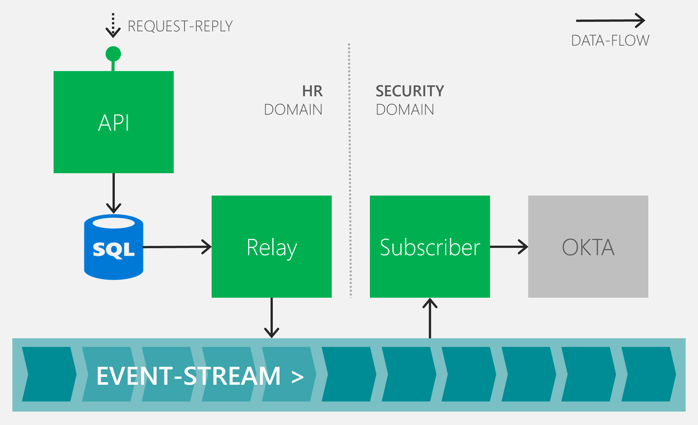

# MyEf.Hr

The purpose of this sample is to demonstrate the usage of _Beef_ (and [_CoreEx_](https://github.com/Avanade/CoreEx) runtime) within the context of a fictitious Human Resources solution. The main intent is to show how _Beef_ can be used against a relational database (SQL Server) leveraging _only_ Entity Framework (EF).

Also, it will demonstrate how the data can be shaped differently between the database and the entity to leverage both relational and object-oriented constructs to provide a natural consuming experience from the API that accounts for the [object-relational impedence mismatch](https://en.wikipedia.org/wiki/Object-relational_impedance_mismatch#:~:text=The%20object-relational%20impedance%20mismatch%20is%20a%20set%20of,to%20database%20tables%20defined%20by%20a%20relational%20schema.).

This sample will walkthrough an approach of adding the capabilities in a series of logical steps, versus big-bang (all at once), as this is more typical of how a developer may implement.

 

## Beef composition

_Beef_ is ostensibly the code-generation engine that ultimately takes dependencies on the following capabilities to enable the end-to-functionality and testing thereof:
- [CoreEx](https://github.com/Avanade/CoreEx) - provides the core runtime capabilties (extends .NET core);
- [UnitTestEx](https://github.com/Avanade/UnitTestEx) - provides extended unit and intra-domain integration testing;
- [DbEx](https://github.com/Avanade/DbEx) - provides extended database management capabilties;
- [OnRamp](https://github.com/Avanade/OnRamp) - provides the underlying code-generation engine functionality.

 

## Scope

Within the sample there will two primary entities exposed:
- **Employee** - being an employee that either is, or was, employed by the ficticous organization.
- **Performance Review** - being a recording of a number of performance reviews for an employee over time.

 

### Employee

This will represent an employee within the organization, and house key data such as their name, address, phone number, gender, date of birth, start and termination dates, and a list of up to five emergency contacts.

From an endpoint perspective it will support the following.

Endpoint | Description
-|-
`GET /employees/id` | Get employee by primary identifier.
`POST /employees` | Create a new employee.
`PUT /employees/id` | Update (replace) the existing employee (only where not terminated).
`PATCH /employees/id` | Patch the existing employee (only where not terminated).
`DELETE /employees/id` | Delete an existing employee (only where not started).
`GET /employees` | Gets employee(s) that match the selection criteria (a subset of the fields to be returned, plus support for paging).
`POST /employees/id/terminate` | Updates the employee as terminated (other endpoints do not allow termination).

 

### Performance Review

This will respresent a performance review (multiple over time), and house key data such as date, outcome, notes and reviewer.

From an endpoint perspective it will support the following.

Endpoint | Description
-|-
`GET /reviews/id` | Get review by primary identifier.
`POST /employees/id/reviews` | Create a review for a specified employee.
`PUT /reviews/id` | Update (replace) the review.
`PATCH /reviews/id` | Patch the existing review.
`DELETE /reviews/id` | Delete an existing review.
`GET /employee/id/reviews` | Gets all review(s) for the employee (with paging support).

 

## Railway-oriented programming

_CoreEx_ version `3.0.0` introduced [monadic](https://en.wikipedia.org/wiki/Monad_(functional_programming)) error-handling, often referred to as [Railway-oriented programming](https://swlaschin.gitbooks.io/fsharpforfunandprofit/content/posts/recipe-part2.html). This is enabled via the key types of `Result` and `Result<T>`; please review the corresponding [documentation](https://github.com/Avanade/CoreEx/blob/main/src/CoreEx/Results/README.md) for more detail on purpose and usage. 

The [`Result`](https://github.com/Avanade/CoreEx/blob/main/src/CoreEx/Results/Result.cs) and [`Result<T>`](https://github.com/Avanade/CoreEx/blob/main/src/CoreEx/Results/ResultT.cs) have been integrated into the code-generated output and is leveraged within the underlying validation. This is intended to simplify success and failure tracking, avoiding the need, and performance cost, in throwing resulting exceptions. 

 

## Core Implementation steps

As described earlier, this sample will walk through the implementation in a number of logical steps:

1. [Solution Skeleton](./docs/1-Solution-Skeleton.md) - start by creating a VS solution from Beef template
2. [Employee DB](./docs/2-Employee-DB.md) - creates the `Employee` database table and related entity framework capabilities.
3. [Employee API](./docs/3-Employee-Api.md) - creates the `Employee` entities, API and related data access logic.
4. [Employee Test](./docs/4-Employee-Test.md) - creates the `Employee` end-to-end integration tests to validate the API and database functionality.
5. [Employee Search](./docs/5-Employee-Search.md) - adds the `Employee` search capability and tests.
6. [Employee Terminate](./docs/6-Employee-Terminate.md) - adds the `Employee` termination capability and tests.
7. [Employee Performance Review](./docs/7-Performance-Review.md) - adds the employee `PerformanceReview` capability end-to-end, from the the database, through the APIs and corresponding testing.

 

## Event Driven Architecture implementation

The implementation so far has created the API capabilities to perform operations on the data as originally defined in the [scope](#Scope). This section can be [skipped](#Conclusion) where the related Event-driven architecture capabilities are not required.

However, to further support the goals of an [Event-driven architecture](https://learn.microsoft.com/en-us/azure/architecture/guide/architecture-styles/event-driven) (EDA) both the publishing and subscribing of events is required, and will be largely enabled leveraging the [CoreEx.Events](https://github.com/Avanade/CoreEx/tree/main/src/CoreEx/Events) capabilities.

 

### Conceptual architecture

The _Conceptual Architecture_ for the solution including eventing/messaging is as follows:

The _Architecture_ is composed of the following components:
- **API** - represents the _HR_ domain API-endpoint;
- **SQL** - represents the _HR_ domain data and outbox repository;
- **Relay** - represents the _HR_ domain Azure Service Bus publishing relay;
- **Subscriber** - represents the _Security_ domain Azure Service Bus subscriber;
- **OKTA** - represents the external [OKTA](https://developer.okta.com/docs/reference/) Identity Management API-endpoints (for Employee User Accounts).
- **Event-stream** - represents the Azure Service Bus capabilities.

The _data-flow_ represented is related to an Employee Termination; in that an Employee's User Account will be automatically _deactivated_ within OKTA as a result of their _termination_.

The _HR_ and _Security_ domains are completely decoupled from each other; in that there is no run-time dependency between them - they only communicate via messages in near-realtime as enabled by the _event-stream_.

 

### Additional implementation steps

This _EDA_ sample will walk through the implementation in a number of logical steps (these describe the integration of the _CoreEx_ capabilities to enable) to achieve the end-to-end Employee's User Account deactivation:

8. [Transactional Outbox](./docs/8-Transactional-Outbox.md) - enqueue events into the database.
9. [Service Bus Publish](./docs/9-Service-Bus-Publish.md) - dequeue events (relay) from database publishing to Azure Service Bus.
10. [Service Bus Subscribe](./docs/10-Service-Bus-Subscribe.md) - simulate an additional domain subscribing to an event (from Azure Service Bus).

 

## Conclusion

The basis of the functional capabilities have been created for our fictitious solution. In the end, the developer should have a reasonable understanding of how to build a relatively complicated back-end (API and database) solution leveraging _Beef_ as the code-generator, and _CoreEx_ as the extended runtime.

The developer should have witnessed that reasonably complicated logic can be built using this _config_ to _code-gen_ to _custom_ approach. Where the _custom_ effort is for the most part focused on the key business value delivery; not the related boilerplate. Plus, with the [_UnitTestEx_](https://github.com/Avanade/UnitTestEx) testing framework, how complex end-to-end intra-domain integration tests can be created to appropriately validate the underlying logic - which can easily be integrated into the developer build-test-release lifecycle.

It is acknowledged that there is a learning curve required for using _Beef_ et al; and in time greater acceleration will be achieved as experience is gained. Please review the extended documentation and provide feedback, questions, defects, etc. via an [issue](https://github.com/Avanade/Beef/issues) to any of the repos.

Thanks and enjoy :-)
