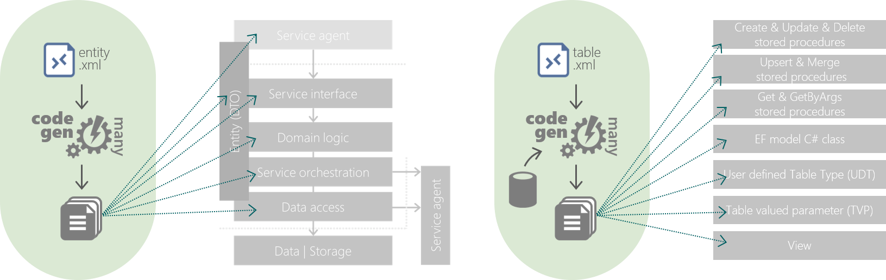

# Beef.CodeGen.Core

This tooling console application assembly contains the _Beef_ code generation capabilities.

Code generation is proposed as a means to greatly accelerate application development where standard coding patterns can be determined and the opportunity to automate exists.

Code generation is intended to bring the following benefits:
- **Acceleration** of development;
- **Consistency** of approach;
- **Simplification** of implementation;
- **Reusability** of layering and framework;
- **Evolution** of approach over time;
- **Richness** of capabilities with limited effort.

There are generally two types of code generation:
- **Gen-many** - the ability to consistently generate a code artefact multiple times over its lifetime without unintended breaking side-effects. Considered non-maintainable by the likes of developers as contents may change at any time; however, can offer extensible hooks to enable custom code injection where applicable.
- **Gen-once** - the ability to generate a code artefact once to effectively start the development process. Considered maintainable, and should not be re-generated as this would override custom coded changes.

_Beef_ primarily leverages **Gen-many** as this offers the greatest long-term benefits.

<br/>

## Code-gen data source

The code-gen is driven by a data source, in this case YAML, JSON or XML. This acts as a type of DSL ([Domain Specific Language](https://en.wikipedia.org/wiki/Domain-specific_language)) to define the key characteristics / attributes that will be used to generate the required artefacts.

<br/>

## Code-gen templates

Once the code-gen data source(s) have been defined, one or more templates will be required to drive the artefact output. These templates are defined using [Handlebars](https://handlebarsjs.com/guide/) and its syntax, or more specifically [Handlebars.Net](https://github.com/Handlebars-Net/Handlebars.Net).

Additionally, _Handlebars_ has been [extended](./Generators/HandlebarsHelpers.cs) to add additional capabilities beyond what is available natively to enable the required generated output.

The _Beef_ standard templates can be found [here](./Templates).

<br/>

## Scripts (code-gen orchestration)

To orchestrate the code generation, in terms of the templates to be used, an XML-based script file is used. The _Beef_ standard scripts can be found [here](./Scripts).

<br/>

## Supported code-gen

The following code generation is supported:



<br/>

### Entity-driven code-gen

The entity-driven gen-many code generation is enabled by an **Entity** configuration file that is responsible for defining the characteristics used by the code-gen tooling. The hierarchy is as follows:

```
└── CodeGeneration
  └── Entity(s)
    └── Property(s)
    └── Const(s)
    └── Operation(s)
      └── Parameter(s)
```

Configuration details for each of the above are as follows:
- `CodeGeneration` - [YAML/JSON](../../docs/Entity-CodeGeneration-Config.md) or [XML](../../docs/Entity-CodeGeneration-Config-Xml.md)
- `Entity` - [YAML/JSON](../../docs/Entity-Entity-Config.md) or [XML](../../docs/Entity-Entity-Config-Xml.md)
- `Property` - [YAML/JSON](../../docs/Entity-Property-Config.md) or [XML](../../docs/Entity-Property-Config-Xml.md)
- `Const` - [YAML/JSON](../../docs/Entity-Const-Config.md) or [XML](../../docs/Entity-Const-Config-Xml.md)
- `Operation` - [YAML/JSON](../../docs/Entity-Operation-Config.md) or [XML](../../docs/Entity-Operation-Config-Xml.md)
- `Parameter` - [YAML/JSON](../../docs/Entity-Parameter-Config.md) or [XML](../../docs/Entity-Parameter-Config-Xml.md)

The **Entity** configuration supported filenames are, in the order in which they are searched: `entity.beef.yaml`, `entity.beef.json`, `entity.beef.xml`, `{Company}.{AppName}.xml`.

The **Entity** configuration is defined by a schema, YAML/JSON-based [entity.beef.json](../../tools/Beef.CodeGen.Core/Schema/entity.beef.json) and XML-based [codegen.entity.xsd](../../tools/Beef.CodeGen.Core/Schema/codegen.entity.xsd). These schema should be used within the likes of Visual Studio when editing to enable real-time validation and basic intellisense capabilities.

<br/>

### Database table-driven code-gen

The database table-driven code generation is enabled by a **Database.xml** file that is responsible for defining the characteristics used by the code-gen tooling. The hierarcy is as follows:

```
└── CodeGeneration
  └── Query(s)
    └── QueryJoin(s)
      └── QueryJoinOn(s)
    └── QueryWhere(s)
    └── QueryOrder(s)
  └── Table(s)
    └── StoredProcedure(s)
      └── Parameter(s)
      └── Where(s)
      └── OrderBy(s)
      └── Execute(s)
```

Configuration details for each of the above are as follows:
- CodeGeneration - [YAML/JSON](../../docs/Database-CodeGeneration-Config.md) or [XML](../../docs/Database-CodeGeneration-Config-Xml.md)
- Query - [YAML/JSON](../../docs/Database-Query-Config.md) or [XML](../../docs/Database-Query-Config-Xml.md)
- QueryJoin - [YAML/JSON](../../docs/Database-QueryJoin-Config.md) or [XML](../../docs/Database-QueryJoin-Config-Xml.md)
- QueryJoinOn - [YAML/JSON](../../docs/Database-QueryJoinOn-Config.md) or [XML](../../docs/Database-QueryJoinOn-Config-Xml.md)
- QueryWhere - [YAML/JSON](../../docs/Database-QueryWhere-Config.md) or [XML](../../docs/Database-QueryWhere-Config-Xml.md)
- QueryOrder - [YAML/JSON](../../docs/Database-QueryOrder-Config.md) or [XML](../../docs/Database-QueryOrder-Config-Xml.md)
- Table - [YAML/JSON](../../docs/Database-Table-Config.md) or [XML](../../docs/Database-Table-Config-Xml.md)
- StoredProcedure - [YAML/JSON](../../docs/Database-StoredProcedure-Config.md) or [XML](../../docs/Database-StoredProcedure-Config-Xml.md)
- Parameter - [YAML/JSON](../../docs/Database-Parameter-Config.md) or [XML](../../docs/Database-Parameter-Config-Xml.md)
- Where - [YAML/JSON](../../docs/Database-Where-Config.md) or [XML](../../docs/Database-Where-Config-Xml.md)
- OrderBy - [YAML/JSON](../../docs/Database-OrderBy-Config.md) or [XML](../../docs/Database-OrderBy-Config-Xml.md)
- Execute - [YAML/JSON](../../docs/Database-Execute-Config.md) or [XML](../../docs/Database-Execute-Config-Xml.md)


The **Entity** configuration supported filenames are, in the order in which they are searched: `database.beef.yaml`, `database.beef.json`, `database.beef.xml`, `{Company}.{AppName}.Database.xml`.

The **Entity** configuration is defined by a schema, YAML/JSON-based [database.beef.json](../../tools/Beef.CodeGen.Core/Schema/database.beef.json) and XML-based [codegen.table.xsd](../../tools/Beef.CodeGen.Core/Schema/codegen.table.xsd). These schema should be used within the likes of Visual Studio when editing to enable real-time validation and basic intellisense capabilities.

Finally, this is not intended as an all purpose database schema generation capability. It is expected that the Tables pre-exist within the database. This database schema/catalog information is queried from the database directly to aid the generation configuration to minimise the need to replicate column configurations within the **Database.xml**.

<br/>

## Console application

The `Beef.CodeGen.Core` can be executed as a console application directly; however, the experience has been optimised so that a new console application can reference and inherit the capabilities.

<br/>

### Commands

The following commands are automatically enabled for the console application (where set up):

- `Entity` - performs code generation using the `Company.AppName.xml` configuration and [`EntityWebApiCoreAgent.xml`](./Scripts/EntityWebApiCoreAgent.xml) script.
- `RefData` - performs code generation using the `Company.RefData.xml` configuration and [`RefDataCoreCrud.xml`](./Scripts/RefDataCoreCrud.xml) script.
- `Database` - performs code generation using the `Company.AppName.Database.xml` configuration and [`Database.xml`](./Scripts/Database.xml) script.
- `DataModel` - performs code generation using the `Company.AppName.DataModel.xml` configuration and [`DataModelOnly.xml`](./Scripts/DataModelOnly.xml) script.
- `All` - performs all of the above (where each is supported as per set up).

There are a number of properties that support changes to these templates above where they need to be overridden.

<br/>

### Program.cs

The `Program.cs` for the new console application should be updated similar to the following. The `Company` and `AppName` values are specified, as well as optionally indicating whether the `Entity`, `RefData`, `Database` and/or `DataModel` commands are supported.

``` csharp
public class Program
{
    static int Main(string[] args)
    {
        return CodeGenConsoleWrapper.Create("Company", "AppName").Supports(entity: true, refData: true).Run(args);
    }
}
```

<br/>

To run the console application, simply specify the required command; e.g:
```
dotnet run entity      -- Default filename: Company.AppName.xml
dotnet run refdata     -- Default filename: Company.RefData.xml
dotnet run datamodel   -- Default filename: Company.AppName.DataModel.xml
dotnet run all         -- All of the above

-- Override the configuration filename from the default.
dotnet run entity -x configfilename.xml
```

</br>

### Personalization and/or overridding

As described above _Beef_ has a set of defined (out-of-the-box) templates and scripts - these do not have to be used, or could be maintained, to achieve an alternate outcome as required.

To avoid the need to clone the solution, and update, add the `Templates` and `Scripts` folders into this console application and embed the required resources. The underlying `Beef.CodeGen.Core` will probe the embedded resources and use the overridden version where provided, falling back on the _Beef_ version where not found. 